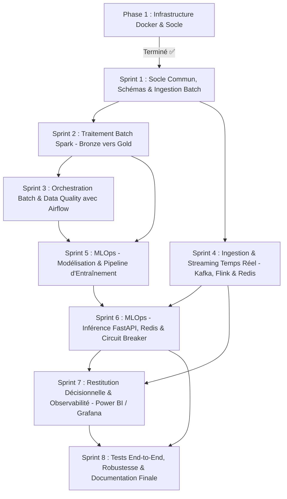

# WattCast — Roadmap de Développement de A à Z par Sprints

Bienvenue dans la feuille de route opérationnelle du projet **WattCast**.  
L'infrastructure de base étant validée et opérationnelle (Phase 1), ce document détaille le découpage méthodique pour développer l'ensemble des composants applicatifs, data pipelines, moteurs de streaming, briques MLOps et dashboards.

---

## Synthèse Globale des Sprints



| Sprint | Nom du Sprint | Objectif Principal | Livrables Clés |
| :--- | :--- | :--- | :--- |
| **Phase 1** | **Infra & Conteneurs** | *Terminé* : Core (PG, MinIO), Batch (Airflow, Spark), Stream (Kafka, Flink, Redis), uv | Compose files, Dockerfiles, Makefile |
| **Sprint 1** | **Socle Commun & Ingestion Batch** | Initialiser les configurations partagées, les schémas PostgreSQL et télécharger les données sources dans MinIO Bronze | `src/common/`, `meteo_archive_fetch.py`, `eco2mix_fetch.py`, DDL PostgreSQL |
| **Sprint 2** | **Traitement Batch avec Spark** | Nettoyer et croiser la météo et la consommation électrique (Médaillon Bronze -> Silver -> Gold) | `spark_bronze_to_silver.py`, `spark_silver_to_gold.py`, tables Parquet & SQL |
| **Sprint 3** | **Orchestration Batch (Airflow)** | Automatiser le pipeline Batch via `DockerOperator` avec contrôle de la qualité des données | `dag_batch_spark.py`, Data Quality Gates |
| **Sprint 4** | **Speed Layer (Kafka, Flink, Redis)** | Collecter la télémétrie temps réel et calculer des fenêtres glissantes à très basse latence | `rte_live_producer.py`, `flink_kpi_live.py`, Feature Store Redis |
| **Sprint 5** | **MLOps : Entraînement & Retraining** | Entraîner le modèle prédictif de charge électrique J+1 et automatiser le réentraînement sur drift | `dataset_builder.py`, `train_model.py`, `dag_ml_training.py` |
| **Sprint 6** | **MLOps : Serving & Résilience** | Exposer une API d'inférence temps réel alimentée par Redis avec pattern de secours Circuit Breaker | `inference.py`, `main.py` (FastAPI), tests de résilience |
| **Sprint 7** | **Restitution & Observabilité** | Visualiser les prédictions et alertes réseau, monitorer la santé technique des pipelines | Dashboard Power BI (ou Streamlit), Dashboards Grafana |
| **Sprint 8** | **Tests End-to-End & Finalisation** | Valider la chaîne complète, tester les pannes et documenter le projet pour les recruteurs | Tests unitaires & E2E, Démonstration, README finalisé |

---

## Détail des Sprints

---

### Sprint 1 : Socle Commun, Schémas de Base de Données & Ingestion Batch (Bronze)
> **Objectif** : Mettre en place les fondations logicielles (config, clients de stockage), concevoir le modèle de données PostgreSQL et ingérer les données historiques dans le Data Lake (MinIO Bronze).

#### 1.1. Socle Commun (`src/common/`)
- [ ] Créer `src/common/config.py` :
  - Utiliser `pydantic-settings` pour charger et valider toutes les variables du fichier `.env` (URLs MinIO/S3, identifiants PostgreSQL, hôtes Kafka, Redis, etc.).
- [ ] Créer `src/common/db_clients.py` :
  - Client S3 / MinIO (boto3 / s3fs) avec gestion du retry et de la création de buckets.
  - Client relationnel PostgreSQL (moteur SQLAlchemy / session psycopg2 / connection pooling).
  - Client Redis (redirection avec mot de passe et ping de santé).
- [ ] Ajouter un module de logging partagé `src/common/logger.py` pour un formatage JSON structuré.

#### 1.2. Modélisation PostgreSQL & Schéma Initial
- [ ] Définir les scripts DDL SQL pour la base PostgreSQL `wattcast` :
  - Table `dim_grid_node` : référentiel des nœuds / sous-stations électriques (id, région, latitude, longitude, capacité max en MW).
  - Table `fact_power_consumption_hourly` : historique consolidé (timestamp, node_id, conso_reelle_mw, temperature_c, vent_kmh, etc.).
  - Table `fact_predictions` : logs des prédictions du modèle (timestamp_prevision, timestamp_cible, node_id, conso_predite_mw, modele_version).
  - Table `model_metrics_history` : suivi des performances (date_evaluation, region, mape, rmse).

#### 1.3. Ingestion Batch dans MinIO Bronze (`src/ingestion/batch/`)
- [ ] `eco2mix_fetch.py` :
  - Téléchargement des archives eCO2mix (RTE) au format XLS/CSV.
  - Parsing et stockage brut immuable dans MinIO :  
    `bucket-bronze/raw/eco2mix/year=YYYY/month=MM/eco2mix_national_YYYY_MM.csv`.
- [ ] `meteo_archive_fetch.py` :
  - Requêtage de l'API Open-Meteo Historical Weather pour les coordonnées des nœuds cibles (France entière ou par région).
  - Sauvegarde brute dans MinIO :  
    `bucket-bronze/raw/meteo/year=YYYY/month=MM/meteo_YYYY_MM.json` (ou `.csv`).
- [ ] Tester les scripts en local avec l'environnement virtuel `uv`.

---

### Sprint 2 : Traitement Batch avec Spark (Couches Silver & Gold)
> **Objectif** : Développer les jobs PySpark conteneurisés pour nettoyer, enrichir et croiser les données de consommation et de météo selon l'architecture en Médaillon.

#### 2.1. Du Bronze vers le Silver (`spark_bronze_to_silver.py`)
- [ ] Initialiser la session Spark avec configuration S3A (`spark.hadoop.fs.s3a.*` pointant vers `minio:9000`).
- [ ] Nettoyage des données eCO2mix :
  - Normalisation des timestamps (passage en UTC ISO-8601).
  - Gestion des valeurs nulles ou aberrantes (interpolation linéaire ou forward-fill temporel).
  - Typage strict (Float, Timestamp, String).
- [ ] Nettoyage des données météo :
  - Extraction de la température à 2m, de la vitesse du vent, de l'ensoleillement (DNI/GHI).
  - Ré-échantillonnage temporel si nécessaire (alignement sur le pas 15 min ou 1h).
- [ ] Écriture dans MinIO `bucket-silver` au format **Parquet** compressé Snappy, partitionné par date :
  - `bucket-silver/consumption/year=YYYY/month=MM/`
  - `bucket-silver/meteo/year=YYYY/month=MM/`

#### 2.2. Du Silver vers le Gold (`spark_silver_to_gold.py`)
- [ ] Lecture des tables Parquet Silver.
- [ ] Jointure temporelle et spatiale : `consumption` $\bowtie$ `meteo` sur `timestamp` et `grid_node_id`.
- [ ] Feature engineering batch :
  - Extraction de features calendaires : `hour_of_day`, `day_of_week`, `is_weekend`, `is_holiday`.
  - Calcul de métriques agrégées (consommation moyenne mobile 24h, pic journalier).
- [ ] Écriture directe dans PostgreSQL (Couche Gold / tables analytiques) via le driver JDBC PostgreSQL :
  - Table `fact_power_consumption_hourly`.
- [ ] Test d'exécution du conteneur Spark éphémère :
  ```bash
  docker run --rm --network wattcast wattcast-spark:4.2.0 spark-submit /opt/spark/src/processing/batch/spark_bronze_to_silver.py
  ```

---

### Sprint 3 : Orchestration Batch & Qualité des Données (Airflow)
> **Objectif** : Automatiser l'ensemble du pipeline Batch avec Apache Airflow en tirant parti du `DockerOperator` pour exécuter Spark sans surcharger la mémoire.

#### 3.1. Implémentation du DAG Batch (`airflow/dags/dag_batch_spark.py`)
- [ ] Configuration du DAG avec planification quotidienne (`schedule_interval="@daily"`).
- [ ] **Task 1 (Ingestion)** : Exécution de l'ingestion quotidienne de la météo et de la consommation de la veille (`PythonOperator` ou conteneur léger).
- [ ] **Task 2 (Spark Bronze -> Silver)** :
  - Utilisation du `DockerOperator` avec l'image `wattcast-spark:4.2.0`.
  - Montage des volumes de code `./src:/opt/spark/src:ro`.
  - Connexion sur le réseau `wattcast`.
- [ ] **Task 3 (Data Quality Gate)** :
  - Script de vérification de l'intégrité des données dans la couche Silver (pas de dates manquantes, seuils de puissance plausibles).
  - Échec du DAG si le contrôle qualité est invalide.
- [ ] **Task 4 (Spark Silver -> Gold)** :
  - `DockerOperator` exécutant `spark_silver_to_gold.py`.
- [ ] Validation dans l'interface Web Airflow (`http://localhost:8080`).

---

### Sprint 4 : Ingestion & Traitement Streaming (Speed Layer - Kafka, Flink & Redis)
> **Objectif** : Concevoir la branche temps réel à haute fréquence (Kappa Layer) pour ingérer la télémétrie réseau, calculer des métriques glissantes et alimenter le cache à chaud Redis.

#### 4.1. Producteur Streaming (`src/ingestion/stream/rte_live_producer.py`)
- [ ] Mise en place du producteur Kafka (`kafka-python` ou `confluent-kafka`).
- [ ] Connexion à l'API RTE Temps Réel (ou mode simulation temps réel haute fidélité basé sur l'historique pour reproduire des flux de compteurs connectés seconde par seconde).
- [ ] Publication des messages dans le topic `telemetry.raw.smartmeters` :
  - Format JSON : `{ "timestamp": "...", "grid_node_id": "NODE_IDF_01", "active_power_mw": 1420.5, "voltage_kv": 225.2, "frequency_hz": 50.01 }`.
  - Partitionnement par clé sur `grid_node_id` pour respecter l'ordre temporel des paquets par nœud.

#### 4.2. Stream Processing avec PyFlink (`src/processing/stream/flink_kpi_live.py`)
- [ ] Déclaration de la Table Source Kafka via le connecteur Flink SQL Kafka.
- [ ] Définition des Watermarks et gestion du temps événementiel (*Event Time*).
- [ ] Calculs en streaming avec fenêtres temporelles :
  - **Tumbling Window 1 min / 5 min** : Consommation moyenne, minimum, maximum par nœud.
  - **Détection d'anomalies en temps réel** : Détection des surtensions ($V > V_{max}$) ou déviations de fréquence ($f < 49.8$ Hz ou $f > 50.2$ Hz).
- [ ] Écriture vers les puits (*Sinks*) :
  - **Redis** : Mise à jour immédiate de la clé `node:{id}:latest_metrics` (Feature Store temps réel à latence < 5ms).
  - Publication des alertes de surtension/rupture dans le topic Kafka `grid.alerts` ou Redis Pub/Sub.
  - **PostgreSQL** : Insertion continue des agrégats 5 minutes pour l'historique chaud.
- [ ] Déploiement et soumission du Job dans le cluster Flink (`http://localhost:8081`).

---

### Sprint 5 : MLOps — Entraînement de Modèle & Détection de Dérive
> **Objectif** : Concevoir un modèle de Machine Learning capable de prédire la charge électrique à J+1 et mettre en place un pipeline automatisé de réentraînement.

#### 5.1. Préparation du Dataset (`src/mlops/training/dataset_builder.py`)
- [ ] Extraction des séries temporelles consolidées depuis la table Gold de PostgreSQL.
- [ ] Construction de la matrice de features :
  - Lags temporels : $y_{t-1}, y_{t-2}, y_{t-24}, y_{t-168}$ (consommation 1h, 2h, 24h et 7 jours avant).
  - Moyennes mobiles glissantes (24h, 7 jours).
  - Features exogènes : prévisions de température, humidité, nébulosité, vent.
  - Variables calendaires encodées (sinus/cosinus pour heure du jour et mois).

#### 5.2. Entraînement & Évaluation du Modèle (`src/mlops/training/train_model.py`)
- [ ] Choix de l'algorithme : **LightGBM / XGBoost Regressor** (performant et robuste pour les séries temporelles tabulaires avec variables exogènes).
- [ ] Découpage temporel rigoureux (Walk-Forward / TimeSeriesSplit pour éviter tout Data Leakage).
- [ ] Calcul des métriques d'évaluation : **MAPE** (Mean Absolute Percentage Error), **RMSE**, **MAE**.
- [ ] Sérialisation du modèle et de ses métadonnées (scalers, feature list, version, date d'entraînement) dans MinIO (`bucket-silver/models/wattcast_model_latest.joblib`).

#### 5.3. Pipeline Airflow de Réentraînement (`airflow/dags/dag_ml_training.py`)
- [ ] DAG exécuté chaque semaine ou déclenché conditionnellement (*Data-driven retraining*).
- [ ] Calcul du MAPE de la semaine écoulée (comparaison table `fact_predictions` vs `fact_power_consumption_hourly`).
- [ ] Si $MAPE > 5\%$ sur une région : déclenchement de la ré-exécution de `train_model.py` et déploiement du nouveau modèle.

---

### Sprint 6 : MLOps — Inférence Temps Réel, FastAPI & Circuit Breaker
> **Objectif** : Exposer un microservice d'inférence sécurisé, ultra-réactif et résilient aux pannes.

#### 6.1. Service d'Inférence (`src/mlops/serving/inference.py` & `main.py`)
- [ ] Développer l'API REST avec **FastAPI** :
  - Endpoint `POST /predict/realtime` : Prédit la charge pour les 24 prochaines heures pour un `grid_node_id` donné.
  - Endpoint `GET /health` : Vérifie l'état de l'API, la connexion Redis et la présence du modèle.
  - Endpoint `GET /alerts` : Liste les alertes récentes issues de Redis.
- [ ] Récupération du contexte :
  - Interrogation de **Redis** pour récupérer instantanément les dernières mesures réelles ($< 5$ ms).
  - Appel à l'API **Open-Meteo Forecast J+1** pour récupérer les prévisions météo du jour visé.
  - Assemblage du vecteur de features et calcul de la prédiction via le modèle chargé en mémoire.

#### 6.2. Implémentation du Pattern Circuit Breaker (Sécurité MLOps)
- [ ] Intégration d'un mécanisme de bascule de secours :
  - Si Redis est indisponible, ou si l'API météo externe échoue, ou si la latence d'inférence dépasse 300 ms :  
    -> Activation immédiate du mode dégradé (utilisation d'un modèle heuristique / consommation de la même journée de la semaine précédente $J-7$).
  - Aucun appel client ne doit lever une erreur 500 bloquante pour les processus décisionnels.
- [ ] Log de la prédiction (et du mode utilisé : normal ou dégradé) dans PostgreSQL `fact_predictions`.

#### 6.3. Conteneurisation du Serving (`docker-compose.ml.yml`)
- [ ] Créer le `Dockerfile` pour le service FastAPI.
- [ ] Compléter `infrastructure/docker-compose.ml.yml` pour démarrer l'API sur le port 8000 relié au réseau `wattcast`.

---

### Sprint 7 : Restitution Décisionnelle & Observabilité
> **Objectif** : Permettre aux gestionnaires du réseau et aux ingénieurs d'exploiter la donnée via des tableaux de bord visuels et du monitoring technique.

#### 7.1. Dashboard Décisionnel (Power BI ou Streamlit / Grafana)
- [ ] Connecter l'outil de BI à la base PostgreSQL (schéma Gold).
- [ ] Conception des vues métiers :
  - **Courbe de Charge & Prédiction** : Comparaison en direct entre la charge réelle et la prédiction J+1 du modèle.
  - **Carte Géographique du Réseau** : Affichage des nœuds électriques avec statut (Normal, Attention, Surcharge).
  - **Médiation de la Donnée & Explicabilité** : Graphique montrant la sensibilité de la consommation face aux variations de température (impact du froid hivernal ou canicule).
  - **Monitoring MLOps Métier** : Suivi de la métrique d'erreur MAPE au cours du temps.

#### 7.2. Observabilité Technique (Grafana & Prometheus)
- [ ] Ajout de Grafana dans `docker-compose.ml.yml` (port 3000).
- [ ] Monitoring des files d'attente Kafka (nombre de messages / seconde, lag des consommateurs).
- [ ] Surveillance de la mémoire et de l'état des conteneurs (MinIO, Flink, Redis, Airflow).

---

### Sprint 8 : Tests End-to-End, Résilience & Documentation Finale
> **Objectif** : Valider l'ensemble du cycle de vie de la donnée, éprouver la robustesse de la chaîne et finaliser un rendu professionnel pour portfolio / soutenance.

#### 8.1. Suite de Tests Automatisés (`tests/`)
- [ ] `test_processing/` : Tests unitaires sur les fonctions de nettoyage Spark et les calculs de fenêtrage Flink avec données synthétiques.
- [ ] `test_mlops/` : Tests de non-régression sur le pipeline de features et vérification du respect du schéma de sortie de l'inférence.
- [ ] Test de résilience du Circuit Breaker (couper Redis et vérifier que l'API renvoie le fallback J-7 sans crasher).

#### 8.2. Simulation Complète d'un Scénario E2E
- [ ] Lancement de l'ensemble de la pile (`make core`, `make batch`, `make stream`, `make ml`).
- [ ] Déroulement complet : Ingestion batch historique $\rightarrow$ Nettoyage Spark $\rightarrow$ Entraînement ML $\rightarrow$ Démarrage du flux streaming Kafka/Flink $\rightarrow$ Appel d'inférence en ligne $\rightarrow$ Affichage sur le Dashboard.

#### 8.3. Documentation & Présentation
- [ ] Finaliser `README.md` avec badges de statut, architecture interactive, instructions de démarrage en 3 commandes et captures d'écran des dashboards.
- [ ] Fournir un script de démonstration / seed pour charger un jeu de test complet en une commande.

---

## Matrice des Compétences & Technologies Démontrées

| Domaine | Technologies Utilisées |
| :--- | :--- |
| **Big Data Batch** | Apache Spark 4.2.0, MinIO S3 (Lakehouse Médaillon), Delta/Parquet |
| **Stream Processing** | Apache Kafka (KRaft), Apache Flink 1.19 (PyFlink), Redis |
| **Orchestration** | Apache Airflow 2.10.2 (DockerOperator) |
| **MLOps & Data Science** | LightGBM / XGBoost, Feature Engineering temporel, Data Drift Detection |
| **API & Déploiement** | FastAPI, Docker, Docker Compose, Réseau multi-conteneurs |
| **Data Viz & BI** | Power BI / Grafana, PostgreSQL 17 |
| **DevOps & Qualité** | uv, Git, Makefile, Pytest, Pydantic |
